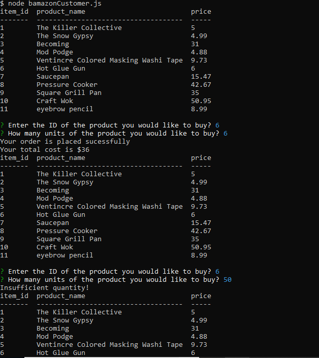
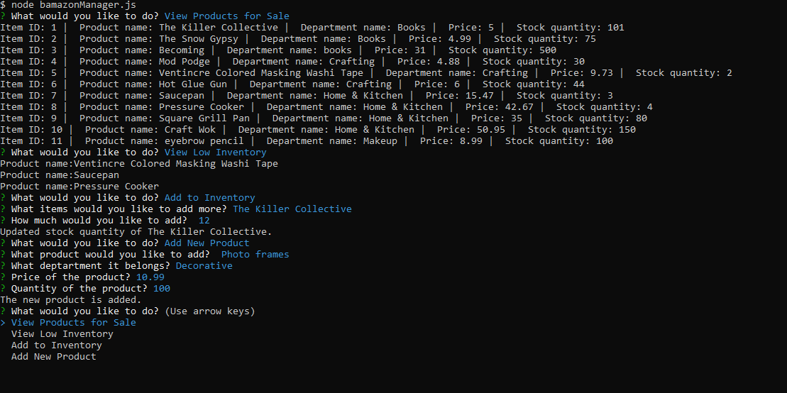
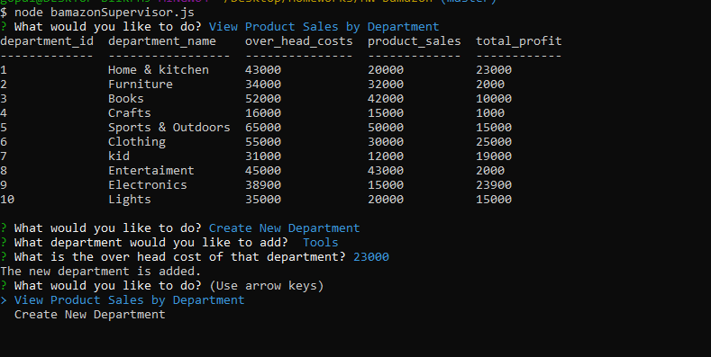

# Bamazon

The goal was to create an Amazon-like storefront using Node.js and MySQL.

<h3>Technologies Used:</h3>

1. Node.js

2. MySQL

<h3>Dependencies:</h3>

npm install mysql

npm install inquirer

<h3>Built With</h3>

MySQLWorkbench & Mamp

<h3>Working example:</h3>

<h4>BamazonCustomer.js<h4>

<h4>BamazonManager.js <h4>

<h4>BamazonSupervisor.js<h4>

